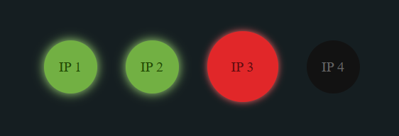

# CheckPingIps : Monitorizar estado de Ip

[](https://github.com/21albertoff/checkPingIp)
[](LICENSE)

💻 Este proyecto es un script en Python que permite monitorear el estado de dispositivos mediante el envío de pings a direcciones IP específicas y guardar los resultados en un archivo JSON. Además, muestra un aviso en caso de tres fallos consecutivos, pero solo la primera vez, y espera una hora antes de mostrar el aviso nuevamente.



## Requisitos

Asegúrate de tener instaladas las siguientes bibliotecas Python antes de ejecutar el script:

- `ping3`: Se utiliza para realizar pings a las direcciones IP.
- `json`: Se utiliza para trabajar con archivos JSON.
- `datetime`: Se utiliza para llevar un registro del tiempo y controlar el aviso.

Puedes instalar la biblioteca `ping3` ejecutando el siguiente comando:

```bash
pip install ping3
```

## Uso

1. Abre el archivo `direccionesIPs.json` en un editor de código.
2. Modifica la lista `direcciones_ip` para incluir las direcciones IP que deseas monitorear.
3. Ejecuta el script `check_ping.py`:

```bash
python check_ping.py
```

El script comenzará a monitorear las direcciones IP especificadas y guardará los resultados en un archivo JSON llamado resultados.json. Además, mostrará un aviso en caso de tres fallos consecutivos, pero solo la primera vez, y esperará una hora antes de mostrar el aviso nuevamente.

## Contribuciones

Las contribuciones son bienvenidas. Si tienes alguna mejora o correción, no dudes en enviar una solicitud de extracción.

## Licencia

Este proyecto está bajo la Licencia MIT. Consulta el archivo LICENSE para obtener más detalles.


